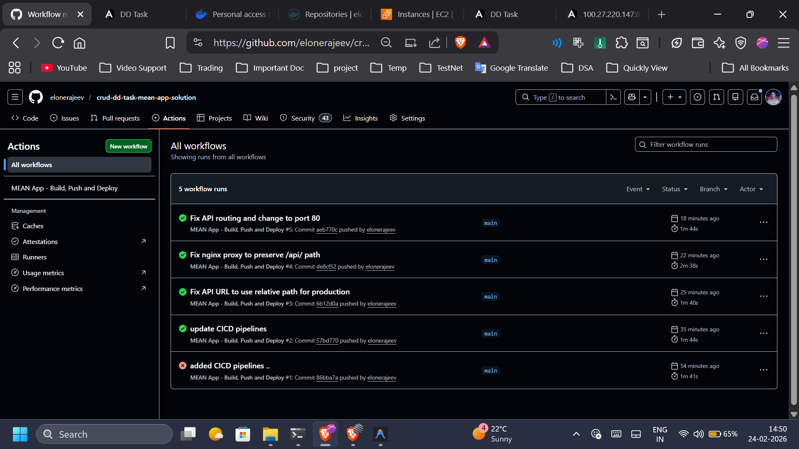
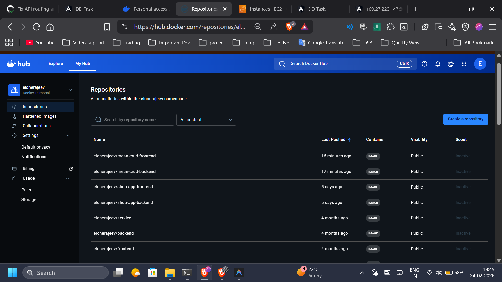

# MEAN Stack CRUD Application - Docker & CI/CD Deployment

A full-stack CRUD application built with MongoDB, Express.js, Angular, and Node.js (MEAN stack), containerized with Docker and deployed using GitHub Actions CI/CD pipeline.

## 🚀 Live Application

**Access the application:** http://100.27.220.147

## 📋 Table of Contents

- [Project Overview](#project-overview)
- [Architecture](#architecture)
- [Technologies Used](#technologies-used)
- [Project Structure](#project-structure)
- [Setup Instructions](#setup-instructions)
- [Docker Configuration](#docker-configuration)
- [CI/CD Pipeline](#cicd-pipeline)
- [Deployment](#deployment)
- [Screenshots](#screenshots)

## 📖 Project Overview

This project demonstrates a production-ready MEAN stack application with:
- **Frontend:** Angular 15 application with CRUD operations
- **Backend:** Node.js/Express REST API
- **Database:** MongoDB for data persistence
- **Containerization:** Multi-stage Docker builds for optimized images
- **CI/CD:** Automated build, push, and deployment using GitHub Actions
- **Reverse Proxy:** Nginx for serving frontend and proxying API requests

## 🏗️ Architecture

```
┌─────────────────────────────────────────────────────────┐
│                    User Browser                          │
└────────────────────┬────────────────────────────────────┘
                     │ HTTP (Port 80)
                     ▼
┌─────────────────────────────────────────────────────────┐
│              Nginx (Frontend Container)                  │
│  - Serves Angular static files                          │
│  - Proxies /api/* to backend                            │
└────────────────────┬────────────────────────────────────┘
                     │ Internal Docker Network
                     ▼
┌─────────────────────────────────────────────────────────┐
│              Backend Container (Node.js)                 │
│  - Express REST API                                      │
│  - Port 8080 (internal only)                            │
└────────────────────┬────────────────────────────────────┘
                     │ Internal Docker Network
                     ▼
┌─────────────────────────────────────────────────────────┐
│              MongoDB Container                           │
│  - Database: dd_db                                       │
│  - Port 27017 (internal only)                           │
└─────────────────────────────────────────────────────────┘
```

## 🛠️ Technologies Used

### Frontend
- Angular 15
- TypeScript
- Bootstrap 4
- RxJS

### Backend
- Node.js
- Express.js
- Mongoose (MongoDB ODM)
- CORS

### DevOps
- Docker & Docker Compose
- GitHub Actions (CI/CD)
- Nginx (Reverse Proxy)
- AWS EC2 (Deployment)

## 📁 Project Structure

```
crud-dd-task-mean-app/
├── frontend/
│   ├── src/
│   │   └── app/
│   │       ├── components/
│   │       ├── models/
│   │       └── services/
│   ├── Dockerfile              # Development Dockerfile
│   ├── Dockerfile.prod         # Production multi-stage build
│   ├── nginx.conf              # Nginx configuration
│   └── package.json
├── backend/
│   ├── app/
│   │   ├── config/
│   │   ├── controllers/
│   │   ├── models/
│   │   └── routes/
│   ├── Dockerfile              # Development Dockerfile
│   ├── Dockerfile.prod         # Production multi-stage build
│   ├── server.js
│   └── package.json
├── .github/
│   └── workflows/
│       └── mean-app-deployment.yml
├── docker-compose.yml
├── pics/                       # Screenshots
└── README.md
```

## 🔧 Setup Instructions

### Prerequisites

- Docker & Docker Compose installed
- Node.js 20+ (for local development)
- Git
- AWS EC2 instance (for deployment)

### Local Development

1. **Clone the repository:**
```bash
git clone https://github.com/elonerajeev/crud-dd-task-mean-app-solution.git
cd crud-dd-task-mean-app-solution
```

2. **Run with Docker Compose:**
```bash
docker-compose up -d
```

3. **Access the application:**
- Frontend: http://localhost:80
- Backend API: http://localhost:80/api/tutorials

4. **Stop the application:**
```bash
docker-compose down
```

## 🐳 Docker Configuration

### Frontend Dockerfile (Production)

**Location:** `frontend/Dockerfile.prod`

```dockerfile
# Stage 1: Build Angular app
FROM node:20-alpine AS builder
WORKDIR /app
COPY package*.json ./
RUN npm install
COPY . .
RUN npm run build

# Stage 2: Serve with Nginx
FROM nginx:alpine
COPY --from=builder /app/dist/angular-15-crud /usr/share/nginx/html
COPY nginx.conf /etc/nginx/conf.d/default.conf
EXPOSE 80
CMD ["nginx", "-g", "daemon off;"]
```

**Key Features:**
- Multi-stage build reduces image size (62.6MB)
- Nginx serves static files efficiently
- Custom nginx.conf for API proxying

### Backend Dockerfile (Production)

**Location:** `backend/Dockerfile.prod`

```dockerfile
# Stage 1: Install dependencies
FROM node:20-alpine AS Builder
WORKDIR /App
COPY package*.json ./
RUN npm install --only=production
COPY . .

# Stage 2: Runtime
FROM node:20-alpine AS Runner
WORKDIR /App
COPY --from=Builder /App/node_modules ./node_modules
COPY --from=Builder /App/server.js ./
COPY --from=Builder /App/app ./app
COPY --from=Builder /App/package.json ./
EXPOSE 8080
CMD ["node", "server.js"]
```

**Key Features:**
- Multi-stage build (156MB final image)
- Production dependencies only
- Minimal runtime image

### Docker Compose Configuration

**Location:** `docker-compose.yml`

```yaml
version: "3.9"

services:
  mongodb:
    image: mongo:6
    container_name: mongodb
    restart: always
    expose:
      - "27017"
    environment:
      MONGO_INITDB_DATABASE: dd_db
    volumes:
      - mongo_data:/data/db
    networks:
      - mean_network

  backend:
    image: elonerajeev/mean-crud-backend:latest
    container_name: backend
    restart: always
    expose:
      - "8080"
    environment:
      PORT: 8080
      MONGO_URI: mongodb://mongodb:27017/dd_db
    depends_on:
      - mongodb
    networks:
      - mean_network

  frontend:
    image: elonerajeev/mean-crud-frontend:latest
    container_name: frontend
    restart: always
    ports:
      - "80:80"
    depends_on:
      - backend
    networks:
      - mean_network

volumes:
  mongo_data:

networks:
  mean_network:
    driver: bridge
```

### Nginx Configuration

**Location:** `frontend/nginx.conf`

```nginx
server {
    listen 80;

    # Serve Angular static files
    location / {
        root /usr/share/nginx/html;
        index index.html;
        try_files $uri $uri/ /index.html;
    }

    # Proxy API requests to backend
    location /api/ {
        proxy_pass http://backend:8080/api/;
        proxy_http_version 1.1;
        proxy_set_header Host $host;
        proxy_set_header X-Real-IP $remote_addr;
        proxy_set_header X-Forwarded-For $proxy_add_x_forwarded_for;
    }
}
```

## 🔄 CI/CD Pipeline

### GitHub Actions Workflow

**Location:** `.github/workflows/mean-app-deployment.yml`

The pipeline consists of two jobs:

#### 1. Build and Push Images

```yaml
build-and-push:
  runs-on: ubuntu-latest
  steps:
    - Checkout code
    - Login to Docker Hub
    - Build backend image
    - Push backend image
    - Build frontend image
    - Push frontend image
```

#### 2. Deploy to EC2

```yaml
deploy-to-ec2:
  runs-on: ubuntu-latest
  needs: build-and-push
  steps:
    - Setup SSH key
    - Copy docker-compose.yml to EC2
    - Stop old containers
    - Pull new images
    - Start containers
    - Clean up old images
```

### Required GitHub Secrets

Configure these in your repository settings:

- `DOCKERHUB_USERNAME`: Your Docker Hub username
- `DOCKERHUB_TOKEN`: Docker Hub access token
- `EC2_SSH_KEY`: Private SSH key for EC2 access
- `EC2_HOST`: EC2 instance public IP
- `EC2_USER`: EC2 username (ubuntu)

### Pipeline Triggers

The pipeline automatically runs on:
- Push to `main` branch
- Manual workflow dispatch

##  Deployment

### AWS EC2 Setup

1. **Launch EC2 Instance:**
   - AMI: Ubuntu 22.04 LTS
   - Instance Type: t2.micro or higher
   - Security Group: Allow ports 22, 80, 443

2. **Install Docker on EC2:**
```bash
sudo apt update
sudo apt install -y docker.io docker-compose
sudo usermod -aG docker ubuntu
```

3. **Create deployment directory:**
```bash
mkdir -p ~/mean-app
```

4. **Configure GitHub Secrets** with EC2 details

5. **Push to GitHub** - Pipeline will automatically deploy

### Manual Deployment

If you prefer manual deployment:

```bash
# SSH to EC2
ssh -i your-key.pem ubuntu@<your-ec2-ip>

# Clone repository
git clone https://github.com/elonerajeev/crud-dd-task-mean-app-solution.git
cd crud-dd-task-mean-app-solution

# Pull images and start
docker-compose pull
docker-compose up -d
```

### Verify Deployment

```bash
# Check running containers
docker ps

# Check logs
docker logs frontend
docker logs backend
docker logs mongodb

# Test API
curl http://localhost/api/tutorials
```

## 📸 Screenshots

### 1. server docker activity 


*showing docker images , and docker compose files with teh latest tgings *

### 2. Pipeline Execution



*CI/CD pipeline successfully building and deploying the application*

### 3. Docker Images on Docker Hub



*Published Docker images on Docker Hub repository*

### 4. Application Running on EC2


*Application successfully deployed and running on AWS EC2*

### 5. Working Application UI


*Live application with CRUD operations working*

## 🔐 Security Considerations

- Backend and MongoDB ports are NOT exposed publicly
- Only frontend (port 80) is accessible from internet
- All inter-service communication happens via internal Docker network


## 📊 Docker Images

- **Frontend:** `elonerajeev/mean-crud-frontend:latest` (62.6MB)
- **Backend:** `elonerajeev/mean-crud-backend:latest` (156MB)


## 👤 Author

**Rajeev Kumar**
- GitHub: [@elonerajeev](https://github.com/elonerajeev)
- Docker Hub: [elonerajeev](https://hub.docker.com/u/elonerajeev)

---

**Repository:** https://github.com/elonerajeev/crud-dd-task-mean-app-solution

**Live Demo:** http://100.27.220.147
